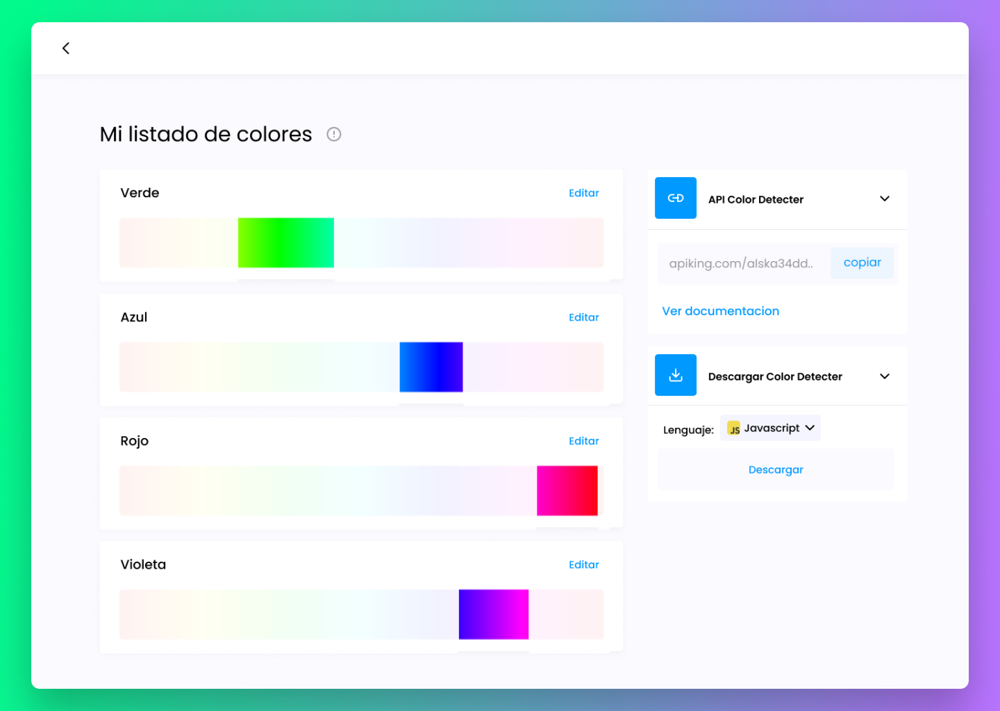

¿Necesitas verificar si un color está dentro de un rango específico? Te ofrecemos una herramienta sencilla que te permite hacer esto.
Puedes usarla en diferentes lenguajes de programación, como Javascript, Python, Java, C y C++ mediante el generador de codigo integrado. También puedes acceder a ella a través de una API.

